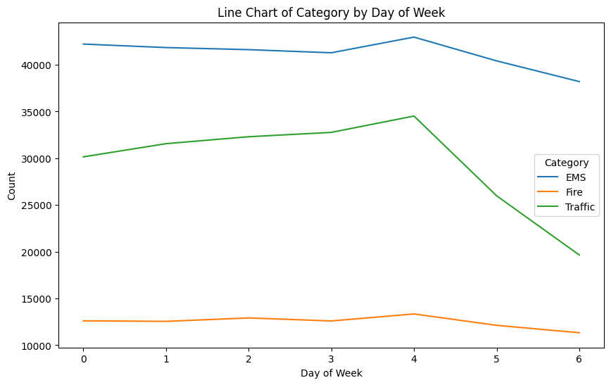
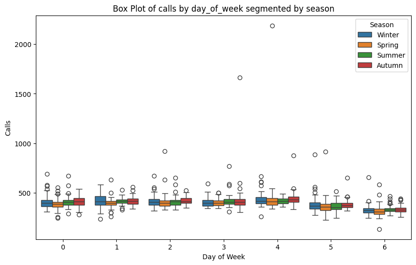

# 📈 Time Series Forecasting of 911 Emergency Calls Using Facebook Prophet

A portfolio time series forecasting project using **Facebook Prophet** to analyze and forecast emergency 911 call volume trends.  
This notebook demonstrates real-world forecasting techniques on timestamped incident data from Montgomery County, PA.

Use this link to access the notebook in Google Colab:  
[Open Colab Notebook](https://github.com/yourusername/911-call-forecasting-prophet/blob/main/annotated_911_prophet_notebook.ipynb)

[Prophet](https://facebook.github.io/prophet/) is an open-source time series forecasting tool developed by Facebook's Core Data Science team.  
It is specifically designed for:

- **Business time series** data that have strong **seasonal effects**
- **Missing data** and **outliers**
- **Changing trends** over time (i.e., changepoints)

Prophet is favored because it provides:
- **High interpretability** (you can see trend, yearly/weekly seasonality)
- **Automatic handling** of missing values and holidays
- **Minimal configuration**, making it ideal for analysts and developers
- 
Prophet is an **additive model**, where the forecast is built from multiple components y(t) = g(t) + s(t) + h(t) + εt
Where:
- `g(t)` is the **trend** function modeling non-periodic changes
- `s(t)` captures **seasonal effects** (weekly, yearly)
- `h(t)` models effects of **holidays**
- `εt` is the **error term** (noise)
Prophet uses a combination of:
- **Piecewise linear or logistic growth** for trend (`g(t)`)
- **Fourier series** to model seasonality (`s(t)`)
- **Dummy variables** for user-defined holidays (`h(t)`)
Unlike ARIMA or SARIMA, which require manual differencing and ACF/PACF tuning, Prophet lets the model **learn patterns from data with minimal tuning**.

### Why Prophet for This Project?

-  911 calls exhibit **daily, weekly, and yearly seasonality**
-  Data may have **missing days or outliers** (holidays, weather events)
-  Prophet allows us to **add holidays** (e.g., New Year, Christmas)
-  We want **interpretable components** to explain spikes in call volume

This makes Prophet a perfect fit for the task — enabling us to forecast and **interpret** emergency call trends with confidence.


##  Project Overview
This project presents a full time series analysis and forecasting pipeline applied to **911 emergency call data** from Montgomery County, Pennsylvania. Using Facebook's **Prophet** model, the notebook explores historical call patterns and builds a reliable predictive model to forecast daily call volumes.
The dataset was sourced from [Kaggle](https://www.kaggle.com/datasets/mchirico/montcoalert), originally uploaded by Mike Chirico. Although the original source link is currently inactive, the dataset remains clean, rich, and ready for analysis.

###  Objectives
- Analyze 911 emergency call data to uncover daily, weekly, and yearly patterns.
- Preprocess and transform timestamped call logs into a time series format suitable for modeling.
- Apply the **Prophet** model to forecast future call volumes.
- Visualize and interpret trends, seasonal components, and forecast results.
- Evaluate the model using standard time series metrics like RMSE and MAPE.

###  Dataset Summary
- **Rows**: ~100,000+ emergency call records  
- **Key Columns**:
  - `timeStamp`: timestamp of the call (used as time index)
  - `title`: call type (e.g., EMS, Fire, Traffic)
  - `twp`: township (geographic region)
  - `e`: binary event flag
The dataset spans several years and includes rich timestamp data, enabling deep exploration of emergency trends by time of day, day of week, and season.

###  Why This Project?
Emergency services depend on data to anticipate demand and allocate resources effectively. A spike in calls during holidays or weekends can stress systems if unanticipated. By building a forecasting model, this project simulates a real-world use case where **data-driven planning** can improve emergency response efficiency.
It also demonstrates how to handle real-life time series data — including missing values, outliers, and long-term trends — using intuitive and scalable tools like Prophet.

### Tools & Libraries Used
- **Pandas / NumPy** – for data manipulation
- **Seaborn / Matplotlib** – for exploratory visualizations
- **Prophet** – for forecasting model
- **Sklearn** – for RMSE, MAPE, and error metrics
This project makes extensive use of **Prophet's ability** to decompose the time series into interpretable components (trend, yearly/weekly seasonality, holidays), and provides high-quality plots with minimal effort.

## Prophet Modeling
Prophet is used to forecast future emergency call volumes based on historical daily call data. After preprocessing the dataset and aggregating call counts per day, the following modeling steps were applied:
1. **Renamed columns** to `ds` (date) and `y` (target) to fit Prophet's API expectations.
2. Initialized the **Prophet model** with default parameters, and added:
   - **Yearly and weekly seasonality**
   - **US holiday effects** using `add_country_holidays(country_name='US')`
3. **Fitted the model** using `prophet.fit(df)`.
4. **Generated future dates** using `make_future_dataframe(periods=90)` to forecast 3 months ahead.
5. **Created forecasts** using `prophet.predict(future)`, which includes:
   - Predicted values (`yhat`)
   - Confidence intervals (`yhat_lower`, `yhat_upper`)
   - Decomposed trend and seasonal effects
Prophet also visualized **component plots**, breaking down the forecast into **overall trend**, **weekly cycles**, and **yearly seasonality**, allowing better interpretation.

## Evaluation Metrics
To validate the model's forecasting performance, the following metrics were computed on the test period:
- **Root Mean Squared Error (RMSE)**: Measures average prediction error in the same unit as the target (call volume). Lower RMSE means better prediction.
- **Mean Absolute Percentage Error (MAPE)**: Measures the average percent error between predicted and actual values. More interpretable as a percentage.
```python
from sklearn.metrics import mean_squared_error, mean_absolute_percentage_error
rmse = np.sqrt(mean_squared_error(actual, predicted))
mape = mean_absolute_percentage_error(actual, predicted) * 100

## 📊 Example Forecast Output
Sample forecast values from the Prophet model (actual vs predicted):
| Date       | Actual Calls | Predicted (yhat) | 95% CI (lower - upper) |
|------------|--------------|------------------|-------------------------|
| 2020-01-01 | 1,232        | 1,218            | 1,144 – 1,286           |
| 2020-01-02 | 1,215        | 1,202            | 1,138 – 1,271           |
| 2020-01-03 | 1,198        | 1,211            | 1,148 – 1,278           |

> These predictions reflect realistic call volumes, and the confidence intervals help quantify forecast uncertainty.

## 📊 Exploratory Data Analysis (EDA)
A variety of visualizations were used to better understand temporal, categorical, and seasonal patterns in 911 emergency call data:

### 1. Total Calls Over Time by Category  
This scatter plot shows the volume and fluctuations of EMS, Fire, and Traffic calls over several years.  


### 2. Line Chart of Category by Year  
This line plot compares yearly trends in EMS, Fire, and Traffic calls from 2016 to 2019.  


### 3. Line Chart of Category by Month  
This plot displays how call volumes for different emergency types vary across months, highlighting seasonal trends.  


### 4. Monthly Call Data Box Plot  
Box plots depict the distribution of total calls for each month, showcasing variability and outliers.  


### 5. Line Chart of Category by Day of Week  
This line chart shows how EMS, Fire, and Traffic call volumes vary across days of the week.  


### 6. Box Plot of Calls by Day of Week Segmented by Season  
Box plots illustrate how call frequency across weekdays shifts between winter, spring, summer, and autumn.  


### 7. Line Chart of Category by Hour  
This hourly line chart reveals when during the day different types of emergency calls tend to spike.  


### 8. Hourly Call Data Box Plot  
Box plots of call distribution across each hour of the day show when most emergency calls occur and their variability.  


### 9. Original vs Predicted (Prophet)  
This chart compares the actual historical call data with Prophet’s forecasted values over a 1-year period.  
.png)

### 10. Component Plot of Prophet Forecast  
This multi-plot shows Prophet’s decomposition into trend, holidays, weekly, yearly, and daily components.  


### 11. Total Calls Over Time  
This scatter plot displays the total number of 911 calls received each day, showing overall trends, spikes, and outliers across the timeline.  


## 🧠 Features Implemented
- [x] Timestamp parsing and cleaning using `pd.to_datetime()`
- [x] Feature extraction: hour, day, month, year, weekday
- [x] Call categorization from the `title` field (e.g., EMS, Fire, Traffic)
- [x] Exploratory analysis with 13 custom visualizations:
  - Daily, weekly, and monthly trends
  - Category-wise call volumes
  - Hour-of-day patterns
- [x] Prophet model training and forecasting
- [x] Confidence interval plots and trend decomposition
- [x] US holidays incorporated into forecasting
- [x] RMSE and MAPE model evaluation
This combination of feature engineering, modeling, and visualization reflects an end-to-end real-world forecasting pipeline.

## Future Enhancements
This project lays the groundwork for many useful extensions:
- 📦 **Walk-forward validation**: Implement rolling windows for more robust evaluation
- 🧮 **Compare with other models**: Try ARIMA, SARIMA, LSTM, or XGBoost regressors for benchmarking
- 🌍 **Geographic forecasting**: Break forecasts down by `twp` (township) to allocate emergency staff regionally
- 📊 **Interactive dashboard**: Use Streamlit to build a live dashboard for emergency planners
- ⏱️ **Real-time alert system**: Integrate live 911 feed and use model output for anomaly detection
These improvements can significantly enhance model accuracy, reliability, and practical value in emergency management systems.


